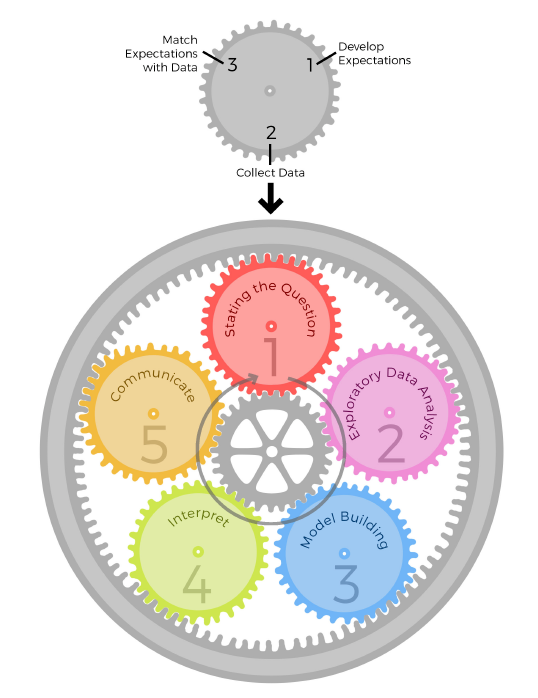
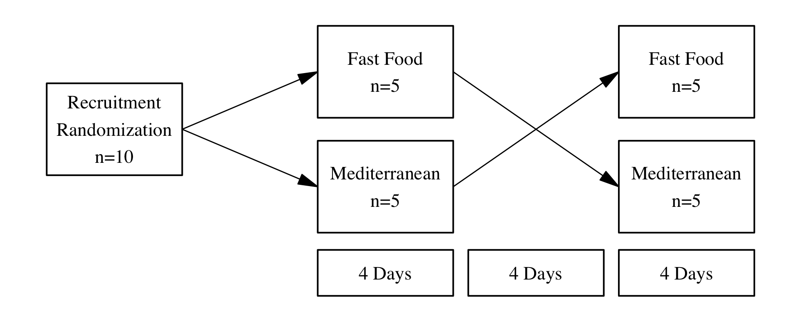
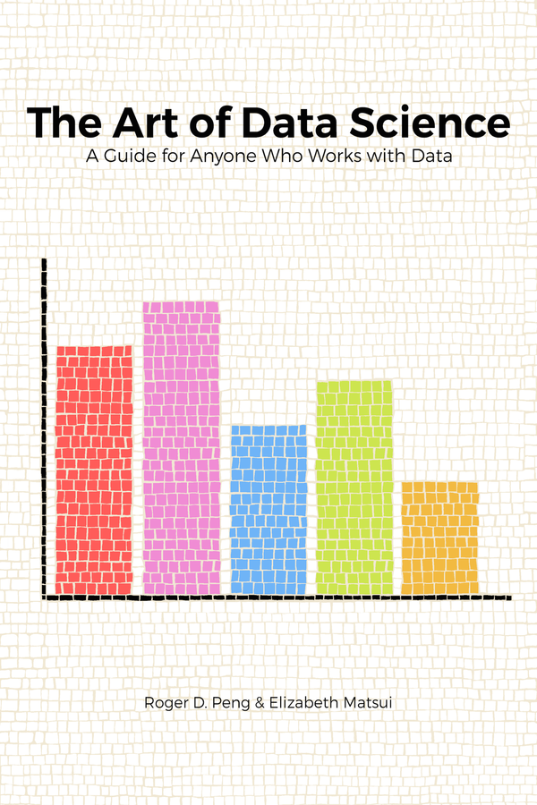

<link rel="stylesheet" href="https://cdnjs.cloudflare.com/ajax/libs/font-awesome/4.7.0/css/font-awesome.min.css">
<script src="https://ajax.googleapis.com/ajax/libs/jquery/3.1.1/jquery.min.js"></script>

```{r setup, include=FALSE}
knitr::opts_chunk$set(echo = FALSE, message = FALSE, error = FALSE, warning = FALSE)
options("kableExtra.html.bsTable" = T)
pkgs = c("dplyr", "reshape2", "ggplot2", "Metabase", "knitr", "kableExtra", 
         "ggsci", "plotly", "cowplot")
for(pkg in pkgs){
    library(pkg, quietly=TRUE, verbose=FALSE, warn.conflicts=FALSE, 
            character.only=TRUE)
}
```

## Science and Art {.build}

<div>
* The tricky part of data science is that even experianced data analysts sometimes can't explain why they do a particle action. 
</div>
<div>
* The knowledge of data analysis is science, but using data science skills to analyze data has artistic components.
</div>
<div>
* *Knuth Computer Programming as an Art*, Donald Knuth 1974:
    - Science is knowledge which we understand so well that we can teach it to a computer.
    - Everything else is art
</div>

## 5 Core Activities of Data Analysis {.build}

1. Stating the question
2. Exploratory data analysis
3. Modeling Building
4. Interpret
5. Communicate

* Data anslysis appears to follow an "one-step-after-the-other" linear process. However in the real world, the information learnt at each step sometimes will inform you whether (and how) to refine, and redo, the step that was just performed, or whether (and how) to proceed to the next step.

## Epicycles of Analysis {.build}

1. Setting Expectations,
2. Collecting information (data), comparing the data to
your expectations, and if the expectations don’t match,
3. Revising your expectations or fixing the data so your
data and your expectations match.

## Epicycles of Analysis (2) {.build}



## Goal of Exploratory Data Analysis {.build}

1. To determine if there are any problems with your
dataset.
2. To determine whether the question you are asking can
be answered by the data that you have.
3. To develop a sketch of the answer to your question.

<!--

## Principles of EDA

* Principle 1: Show comparisons
    - Evidence for a hypothesis is always relative to another competing hypothesis.
    - Always ask "Compared to What?"

```{r}
boxplot(tips$tip)
```

```{r}
boxplot(tip ~ size, data=tips)
```

* Principle 2: Show causality, mechanism, explanation, systematic structure
    - What is your causal framework for thinking about a question?

```{r}
tips$day = factor(tips$day, levels = c("Thur", "Fri", "Sat", "Sun"))
ggplot(tips) +
    geom_boxplot(aes(sex, tip)) +
    facet_grid(cols = vars(size))
```

* Principle 3: Show multivariate data
    - Multivariate = more than 2 variables
    - The real world is multivariate
    - Need to "escape flatland"

```{r}
ggplot(tips) +
    geom_point(aes(total_bill, tip, color = sex, size = size)) +
    facet_grid(~day)
```

* Principle 4: Integration of evidence
    - Completely integrate words, numbers, images, diagrams
    - Data graphics should make use of many modes of data presentation
    - Don't let the tool drive the analysis

* Principle 5: Describe and document the evidence with appropriate labels, scales, sources, etc.
    - A data graphic should tell a complete story that is credible

* Principle 6: Content is king
    -Analytical presentations ultimately stand or fall depending on the quality, relevance, and
integrity of their content

-->

## Case Study: FFS HDL Lipidome {.build}

A reminder of the fast food study design



## Lipidomics

* The lipidomics is a subset of metabolimcs that aims at identifying and quantifying all lipid species from a biological or enviromental sample.

* The west coast metabolomics center's untargeted lipidomics platform is now able to detect and quantify over 300 lipid speceis in 14 lipid classes.

* Because HDL is a lipid-protein complex, what lipid speceis present in HDL and their quantity affect the HDL function.

* The lipidomics technique is used a lot by us to study the lipid composition of HDL.


## Case Study: FFS HDL Lipidome (2) {.build}

* Check the dimensions (number of rows and number of columns) of the data:

```{r, echo = FALSE}
file = "data/mx 302870_Zhu_CSH-QTOF MS lipidomics_03-2017_submit.xlsx"
lpd = import_wcmc_excel(
    file = file,
    sheet = "Submit",
    conc_range = "I9:BA612",
    feature_range = "A8:H612",
    sample_range = "H1:BA8",
    InChIKey = "InChI Key",
    experiment_type = "Lipidomics"
)
edata = lpd$conc_table
fdata = lpd$feature_data
pdata = lpd$sample_table
```

```{r, include = TRUE, echo = TRUE}
dim(edata)
```

## Case Study: FFS HDL Lipidome (3) {.build}

* Question 1: Why does it have 45 samples not 40?
* Check the top and tial of the sample data

```{r}
head(pdata) %>%
    knitr::kable() %>%
    kable_styling(bootstrap_options = c("striped", "bordered"), font_size = 15) %>%
    row_spec(0, font_size = 15)
```

## Case Study: FFS HDL Lipidome (4) {.build}

* Remove QCs and check dimensions again

```{r, echo = FALSE}
lpd = collapse_QC(lpd, qc_names = paste0("Biorec00", 1:5))
edata = lpd$conc_table
fdata = lpd$feature_data
pdata = lpd$sample_table
dim(edata)
```

## Case Study: FFS HDL Lipidome (5) {.build}

* Question 2: Are the 604 features all successfully annotated?
* Look at the top of the feature data

```{r}
head(fdata) %>%
    knitr::kable() %>%
    kable_styling(bootstrap_options = c("striped", "bordered"), font_size = 15) %>%
    row_spec(0, font_size = 15)
```

## Case Study: FFS HDL Lipidome (6) {.build}

* Look at the tail of the feature data

```{r}
tail(fdata) %>%
    knitr::kable() %>%
    kable_styling(bootstrap_options = c("striped", "bordered"), font_size = 15) %>%
    row_spec(0, font_size = 15)
```

## Case Study: FFS HDL Lipidome (7) {.build}

* We can then make a count plot of rows (features) with annotation vs without annotation
* Looks like there are many features without an annotation. We can just remove them

```{r, fig.align="center", fig.height = 3.5}
(fdata %>%
    ggplot() +
    geom_bar(aes(x = is.na(Annotation), fill = is.na(Annotation))) +
    theme_bw()) %>%
    ggplotly
```

```{r}
lpd = subset_features(lpd, !is.na(lpd$feature_data$Annotation))
edata = lpd$conc_table
fdata = lpd$feature_data
pdata = lpd$sample_table
```

## Case Study: FFS HDL Lipidome (8) {.build}

* Now we removed all the rows without the annotation. 
* Question 3: are there any missing values?

```{r}
plot_hist_NA(lpd)
```

## 3 types of "Missing Values" {.build}

* There are three types of "missing values":
    * The data is missing (dietary record missing for a subject at one time point)
    * Failed to be sampled (count data such as 16S-seq)
    * Zero (quantitative method)
* Our solution:
1. remove features with to many zeros
2. fill the NAs with a reasonable small value

## Case Study: FFS HDL Lipidome (9) {.build}

* Does each individual row have unique feature annotation?

```{r}
(table(table(fdata$Annotation)) %>%
    as.data.frame %>%
    ggplot() +
    geom_col(aes(x = Var1, y = Freq, fill = Var1)) +
    labs(x = "Number of occurance of the feature Annotation", y = "Count") +
    theme_bw()) %>%
    ggplotly
```

## Case Study: FFS HDL Lipidome (10) {.build}

```{r}
fdata %>%
    mutate(ESI = ifelse(grepl("\\+$", fdata$Species), "Pos", "Neg")) %>%
    group_by(Annotation) %>%
    mutate(occurrance = length(Annotation)) %>%
    filter(occurrance == 2) %>%
    with(table(ESI))
```

```{r}
# -------- filter out or fill up NAs -------------------------------------------
lpd = subset_features(
    lpd, apply(conc_table(lpd), 1, function(x) sum(is.na(x)) < 5) )
lpd = transform_by_feature(
    lpd, function(x) ifelse(is.na(x), min(x, na.rm = TRUE)/2, x)
)
# -------- calibration to internal standards -----------------------------------
standards = read.csv("data/wcmc_lipidomics_standards.csv")
feature_data(lpd)$class = assign_lipid_class(feature_data(lpd)$Annotation)
feature_data(lpd)$ESI = ifelse(grepl("\\+$", feature_data(lpd)$Species),
                                    "pos", "neg")
experiment_data(lpd)$institute = "West Coast Metabolomics Center"
experiment_data(lpd)$sample_volumn_ul = 20
experiment_data(lpd)$internal_standards = standards
lpd = calibrate_lipidomics_wcmc(lpd, cid = "InChIKey", 
                                     class = "class", ESI = "ESI")
# -------- if detected in both modes, keep the one with lower cv ---------------
lpd = filter_by_cv(lpd, cv = "qc_cv", cid = "InChIKey")
## -------- formate annotation -------------------------------------------------
lpd$feature_data$Annotation = lipid_name_formater(lpd$feature_data$Annotation)
sampleNames(lpd) = gsub("\\-", "", sampleNames(lpd))
lpd$sample_table$Subject = gsub("^FFS([0-9]{3})[A-D]{1}$", "\\1", sampleNames(lpd))
lpd$feature_data$Annotation = make.unique(lpd$feature_data$Annotation)
featureNames(lpd) = lpd$feature_data$Annotation
```

## Case Study: FFS HDL Lipidome (11) {.build}

* Now we can run hypothesis test using linear model. We can make a histogram of the P values of the 170 features

```{r}
lpd_prop = transform_by_sample(lpd, function(x) x/sum(x))
design = model.matrix(
    data = as(lpd$sample_table, "data.frame"),
    ~ Treatment * Timepoint + Subject + 1
)
limma_conc = mSet_limma(lpd, design, p.value = 13, coef = 13)
limma_prop = mSet_limma(lpd_prop, design, p.value = 13, coef = 13)
```

```{r}
ggplot(limma_conc) +
    geom_histogram(aes(pvalue), binwidth = 0.025, color = "white") +
    theme_bw()
```

## Case Study: FFS HDL Lipidome (12) {.build}

* If you have 10000 random variables and we run statistic analysis, what would the distribution of p values look like?

```{r}
df = sapply(1:10000, function(x) rnorm(40)) %>%
    t %>% as.data.frame
limma_sim = limma::lmFit(df, design)
ebayes = limma::eBayes(limma_sim)
top = limma::topTable(ebayes, p.value = 13, sort.by = "none", number = 10000)
ggplot(top) +
    geom_histogram(aes(P.Value), binwidth = 0.025, color = "white") +
    theme_bw()
```

## Case Study: FFS HDL Lipidome (13) {.build}

* We can plot some features that have a significant p value. And there is a person seems always different from other subjects.

```{r}
odd = summarize_odd_chain(lpd, "Annotation", "class")
```

```{r}
p1 = plot_boxplot(lpd, feature = "PC 34:2 p", x = "Timepoint", cols = "Treatment", line = "Subject", color = "Subject") +
    labs(title = "PC 34:2 p") +
    theme(plot.title = element_text(hjust = 0.5))
lgd = get_legend(p1)
p1 = p1 + theme(legend.position = "none")

p2 = plot_boxplot(lpd, feature = "PC 33:0", x = "Timepoint", cols = "Treatment", line = "Subject", color = "Subject") +
    labs(title = "PC 33:0") +
    theme(plot.title = element_text(hjust = 0.5),
          legend.position = "none")
p3 = plot_boxplot(lpd, feature = "PC 36:2 p.1", x = "Timepoint", cols = "Treatment", line = "Subject", color = "Subject") +
    labs(title = "PC 36:2 p.1") +
    theme(plot.title = element_text(hjust = 0.5),
          legend.position = "none")
p4 = plot_boxplot(odd, feature = "PC", x = "Timepoint", cols = "Treatment", line = "Subject", color = "Subject") +
    labs(title = "Odd Chain FA in PC")+
    theme(plot.title = element_text(hjust = 0.5),
          legend.position = "none")
plot_grid(
    plot_grid(p1,p2,p3,p4,nrow=2, align = "hv", axis = "tblr"),
    lgd, ncol=2, rel_widths = c(6,1)
)
```

## Case Study: FFS HDL Lipidome (14) {.build}

* After we fix the mislabelled 116

```{r}
lpd$sample_table$Treatment[33:36] = c("Med", "Med", "FF", "FF")
design = model.matrix(
    data = as(lpd$sample_table, "data.frame"),
    ~ Treatment * Timepoint + Subject + 1
)
limma = mSet_limma(lpd, design, coef = 13, p.value = 13)
ggplot(limma) +
    geom_histogram(aes(pvalue), binwidth = 0.025, color = "white") +
    theme_bw()
```

## Case Study: FFS HDL Lipidome (15) {.build}

```{r}
odd = summarize_odd_chain(lpd, "Annotation", "class")
```

```{r}
p1 = plot_boxplot(lpd, feature = "PC 34:2 p", x = "Timepoint", cols = "Treatment", line = "Subject", color = "Subject") +
    labs(title = "PC 34:2 p") +
    theme(plot.title = element_text(hjust = 0.5))
lgd = get_legend(p1)
p1 = p1 + theme(legend.position = "none")

p2 = plot_boxplot(lpd, feature = "PC 33:0", x = "Timepoint", cols = "Treatment", line = "Subject", color = "Subject") +
    labs(title = "PC 33:0") +
    theme(plot.title = element_text(hjust = 0.5),
          legend.position = "none")
p3 = plot_boxplot(lpd, feature = "PC 36:2 p.1", x = "Timepoint", cols = "Treatment", line = "Subject", color = "Subject") +
    labs(title = "PC 36:2 p.1") +
    theme(plot.title = element_text(hjust = 0.5),
          legend.position = "none")
p4 = plot_boxplot(odd, feature = "PC", x = "Timepoint", cols = "Treatment", line = "Subject", color = "Subject") +
    labs(title = "Odd Chain FA in PC")+
    theme(plot.title = element_text(hjust = 0.5),
          legend.position = "none")
plot_grid(
    plot_grid(p1,p2,p3,p4,nrow=2, align = "hv", axis = "tblr"),
    lgd, ncol=2, rel_widths = c(6,1)
)
```

## Review {.columns-2} 

5 core activities of data anlysis

1. Stating the question
2. Exploratory data analysis
3. Modeling Building
4. Interpret
5. Communicate

<p class="forceBreak"></p>

Epicycles of analysis

1. Setting Expectations,
2. Collecting information (data), comparing the data to
your expectations, and if the expectations don’t match,
3. Revising your expectations or fixing the data so your
data and your expectations match.


## Reference

[*The Art of Data Science*](https://leanpub.com/artofdatascience), by Roger D. Peng and Elizabeth Matsui, available free on learnpub

